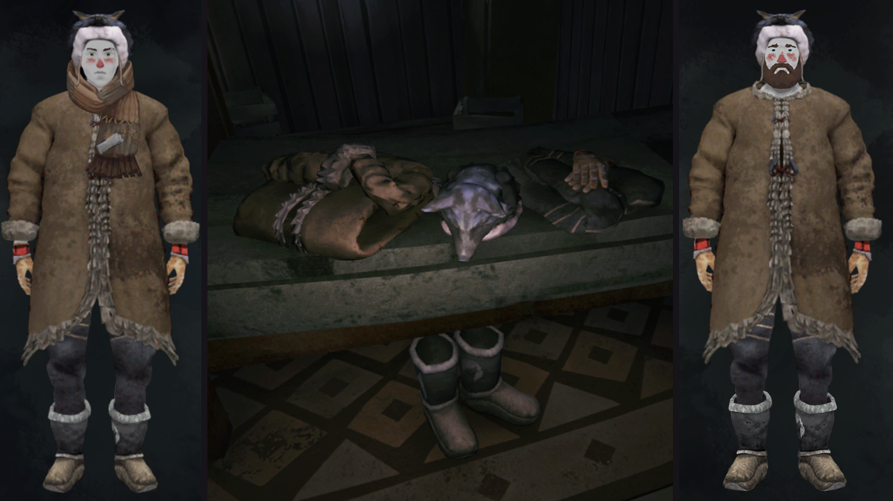

## Northfolk Clothing Pack
Remember deerskin coat mod by nbakulev? This is him now. You can take a closer look in [this video](https://www.youtube.com/watch?v=zEhb0MKxVQQ) ;)

## Description
Adds 2 previously seen + 3 more brand new craftable clothing items:

 

### Bearskin Leggings 
`GEAR_BearskinLeggings`

---

 

### Deerskin Coat
`GEAR_DeerskinCoat`

---

 

### Deerskin Gloves
`GEAR_DeerskinGloves`

---

### Wolfskin Boots
`GEAR_WolfskinBoots`

---

 

### Wolfskin Hat
`GEAR_WolfskinHat`

---

## Installation
It's a standard modcomponent pack, so just throw it in `.../Mods/`

Requires [ModComponent](https://github.com/ds5678/ModComponent/releases). 

## Shoutout
[@nbakulev](https://github.com/nbakulev) for his original [mod](https://github.com/nbakulev/Deerskincoat).  
[@ds5678](https://github.com/ds5678) for placing items I made in order, adding blueprints and stuff.  
[@TheDevv](https://github.com/TheDevv) for english item descriptions.  
[@DigitalzombieTLD](https://github.com/DigitalzombieTLD) for german translations.  
